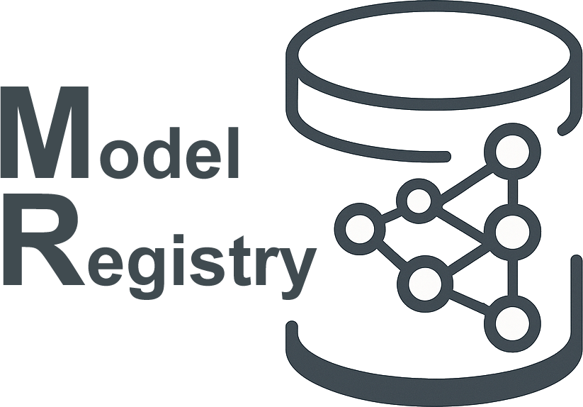

# Model Registry

This repository provides a FastAPI-based machine learning service for deploying soft sensors. The service allows users to send input data and receive predictions from different machine learning models.


A centralized registry for managing, browsing, and serving machine learning models (Python and R).
This project provides:

- A Backend service for model and project management
- A REST API to interact with models and metadata
- A Web/Dashboard layer
- Utilities to load, register, and manage ML projects and artifacts

## Overview

- Purpose: centralize projects and models, provide prediction endpoints and a dashboard to manage artifacts.
- Primary languages: Python (app and dashboard) and R (supporting model artifacts and helper scripts under `model_registry/services/r`).
- Repo contains example projects under `projects/` and `model_registry/projects/`.

## Requirements

- Python 3.8+
- Poetry for dependency and environment management (recommended)
- Optional: R if you use the R model artifacts, Docker for containerized deployments

## Project Structure

```
model-registry/
├── model_registry/
│   ├── api/
│   │   ├── config/
│   │   ├── models/
│   │   ├── projects/
│   │   ├── routes/
│   │   ├── services/
│   │   ├── utils/
│   │   └── app_api.py
│   ├── backend/
│   │   ├── assets/
│   │   ├── callbacks/
│   │   ├── components/
│   │   ├── config/
│   │   ├── data/
│   │   ├── layouts/
│   │   ├── models/
│   │   ├── pages/
│   │   ├── services/
│   │   └── app_backend.py
│   └── postgres/
│       ├── docker-entrypoint-initdb.d/
│       ├── .env
│       └── .env.example
├── docker-compose.yml
├── LICENSE
├── pyproject.toml
└── README.md
```

## Running with Docker Compose

Docker Compose starts the full local stack, including the backend dashboard,
REST API, and PostgreSQL database.

### Requirements

- Docker
- Docker Compose v2+

### Start the application

Create the required environment files from the provided examples:

```bash
cp model_registry/api/.env.example model_registry/api/.env
cp model_registry/backend/.env.example model_registry/backend/.env
cp model_registry/postgres/.env.example model_registry/postgres/.env
```

Then start the stack:

```bash
docker compose up --build
```

After the containers are running, open:

- Backend Dashboard: http://localhost
- REST API: http://localhost:8080
- PostgreSQL: localhost:5432

To stop the stack, press `Ctrl+C` in the terminal running Docker Compose, or run:

```bash
docker compose down
```

## Setup with Poetry

1. Install Poetry (if not installed):

```bash
# macOS / Linux
curl -sSL https://install.python-poetry.org | python3 -

# Windows (PowerShell)
(Invoke-WebRequest -Uri https://install.python-poetry.org -UseBasicParsing).Content | python -
```

2. Verify installation:

```bash
poetry install
```

3. Install dependencies and create the virtual environment:

```bash
poetry install
```

Notes:

- Project metadata and dependencies are defined in `pyproject.toml`.

## Running the application Poetry

The project is split into  **two main services** :

▶ Backend Service

Starts the core backend responsible for model and project management.

```bash
poetry run ml-repository-backend
```

Adjust the command as needed for your deployment (WSGI server, Docker, etc.).

▶ API Service

Starts the REST API layer

```bash
poetry run ml-repository-api
```

💡 Run each service in a separate terminal during development.

## Configure .env

To configure the project environment variables, create each `.env` file from its matching `.env.example` file in the `api`, `backend`, and `postgres` directories.

## Quick Start (Docker)

The easiest way to run the Model Registry locally is using Docker Compose.

### Requirements

- Docker
- Docker Compose v2+

### Run

```bash

## Setup

Clone the repository:

```bash
git clone https://gitlab.com/stamm-4m/model-registry.git
cd model-registry
docker compose up --build
```

*Vendorized metadata_tools module

The metadata_tools code is included directly in this repository under:

-model_registry/backend/vendor/metadata_tools

The project no longer uses Git submodules for this dependency. If the upstream faridom:seek project is updated, the files inside the vendor/metadata_tools directory must also be manually updated to keep the local version synchronized.

Open the following URLs in your browser:

Service  -	URL

- Backend (Dashboard)	http://localhost
- API (REST)	http://localhost:8080

Health check

If the containers are running, you should see logs similar to:

- Backend running on port 80
- API running on port 8080

## Contributing

- Follow existing code style and add tests for new features.
- Open an issue to discuss significant changes.

## License

See [LICENSE](LICENSE)
