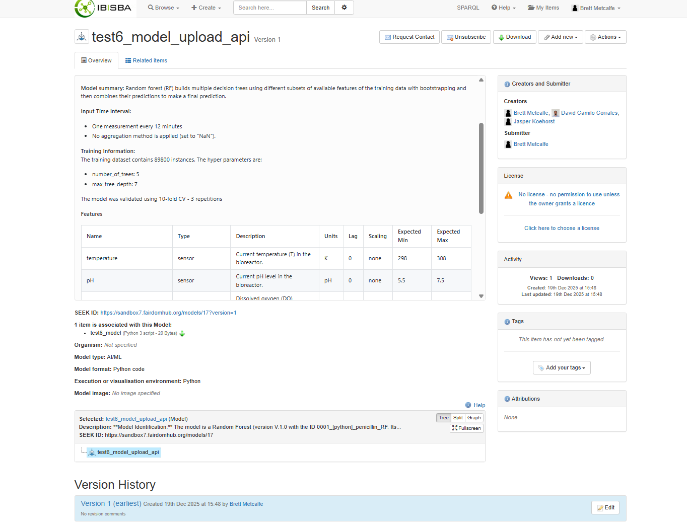
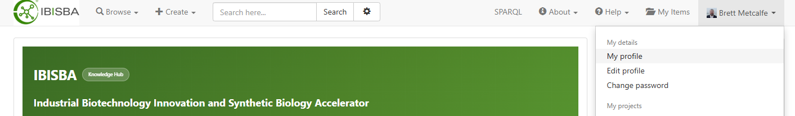
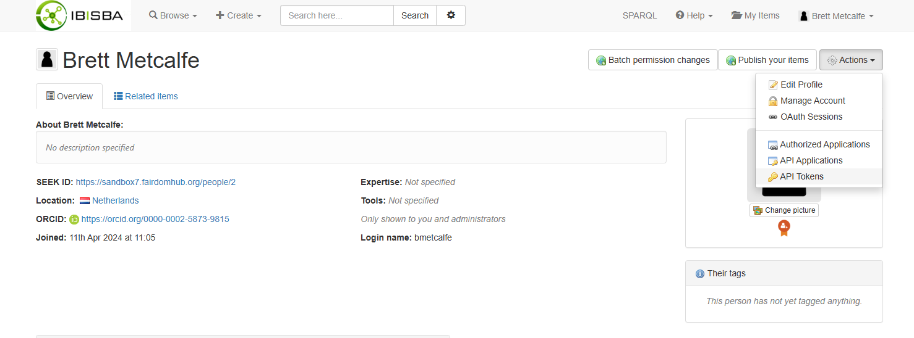
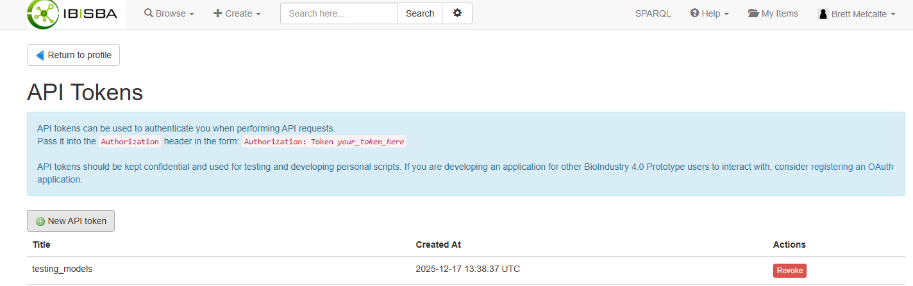
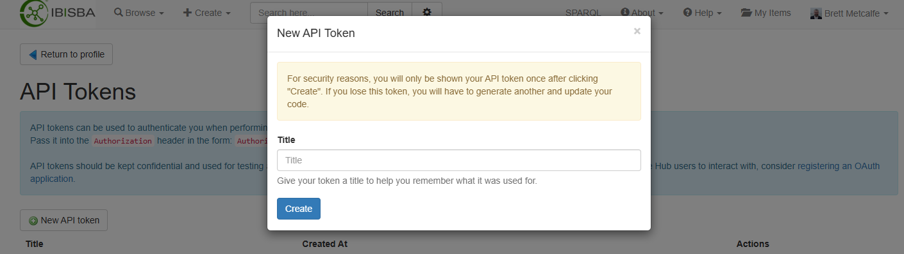

# metadata_tools

## Model2Seek


**Figure 1: Example of model2seek output in a FAIRDOM-SEEK instance.**

Add a artificial intelligence (AI) or machine learning (ML) model to a FAIRDOM-SEEK instance using the Soft sensor moniToring and 
mAintenance framework for Machine learning Models ([STAMM](https://gitlab.com/stamm-4m)) metadata YAML template. This includes the
generation of input and output tables in a table format and a detailed description of the model including requirements, training, 
validation, etc. (**Figure 1**).<br>


## API Token

Users can decide to either use an API token (`token`) or, if this remains `None`, they can authenticate with the FAIRDOM-SEEK instance
with their username and password via the `getpass` python package.<br>  


### Make a token (visual guide)

<details><summary>Click to expand for Figure 2</summary>

**Figure 2: Menu to your profile page of a FAIRDOM-SEEK instance.**
</details>


<details><summary>Click to expand for Figure 3</summary>

**Figure 3: Profile page of a FAIRDOM-SEEK instance.**
</details>


<details><summary>Click to expand for Figure 4</summary>

**Figure 4: API Token page of a FAIRDOM-SEEK instance.**
</details>


<details><summary>Click to expand for Figure 5</summary>

**Figure 5: API Token menu in the API Token page of a FAIRDOM-SEEK instance.**
</details>


### Make a token 

To make a FAIRDOM-SEEK token:

1. Login (or register) for the FAIRDOM-SEEK instance you are interested in (e.g., [fairdomhub](https://fairdomhub.org/))

2. Go to `My profile` by clicking on your user icon at the top right of the screen (_see_ **Figure 2**)

3. On your profile page click `Actions` (_see_ **Figure 3**)

4. In the `Actions` menu click `API Tokens` (_see_ **Figure 3**)

5. In the `API Tokens` menu (_see_ **Figure 4**) click `New API token` and follow the on-screen instructions to create a title for your new token (_see_ **Figure 5**).

6. Save the token somewhere but make sure to give it `model2seek`.

If you need to remove or revoke the token at any point navigate back to the `API Tokens` menu and click the red `Revoke` button.


## Examples
### Example: Add a model

To add a new `model` to a FAIRDOM-SEEK instance (defined by `base_url`) a user can use the `add_model` function of model2seek:

``` python

    #------------------
    # API Token
    api_token = 'YOUR-TOKEN-FROM-FAIRDOM-SEEK'

    #------------------
    # Initialise Class
    m2s = model2seek(
                    base_url= 'https://sandbox7.fairdomhub.org', # the FAIRDOM-SEEK instance you want to add to / query
                    token=api_token  # your API token
                    )

    #------------------
    # Start a request session
    m2s.start_session()

    #------------------
    # Add a model to the FAIRDOM-SEEK
    m2s.add_model(
                    model_metadata_yml = '0001_[python]_penicillin_RF.yaml', # Model metadata yaml file
                    model_filename= 'test6_model',  # the name of the model's file
                    model_filepath = 'test_model.py', # the filepath of the model
                    containing_project_id = 17, # the project ID
                    model_title = 'test6_model_upload_api', # the title of the model's FAIRDOM-SEEK title
                    model_creators= [2,3,4] # the model creator's FAIRDOM-SEEK person IDs
                  )

```

### Example: Query an asset type

To query an asset (`projects`, `models`, etc. ) you can use the following code, replacing `type_` with a FAIRDOM-SEEK asset type

``` python

    #------------------
    # API Token
    api_token = 'YOUR-TOKEN-FROM-FAIRDOM-SEEK'


    #------------------
    # Initialise Class    
    m2s = model2seek(base_url= 'https://sandbox7.fairdomhub.org', token=api_token)

    #------------------
    # Start a request session    
    m2s.start_session()

    #------------------
    # Query     
    output = m2s.json_for_resource(type_= 'projects', id_ = 17)
    m2s.pretty_print_(output)

```

A different asset (i.e., replacing `projects` for `models`) can be queried by replacing the `type_`:

``` python

    #------------------
    # Query
    output = m2s.json_for_resource(type_= 'models', id_ = 10)
    m2s.pretty_print_(output)


```

### Example: List an asset

To list the assets of a particular type you can use the following code, replacing `type_` with a FAIRDOM-SEEK asset type

``` python

    #------------------
    # API Token
    api_token = 'YOUR-TOKEN-FROM-FAIRDOM-SEEK'


    #------------------
    # Initialise Class    
    m2s = model2seek(base_url= 'https://sandbox7.fairdomhub.org', token=api_token)

    #------------------
    # Start a request session    
    m2s.start_session()

    #------------------
    # Query  
    output2 = m2s.list_metadata(type_ = 'models')
    m2s.pretty_print_(output2)

```


### Example: Load the metadata

To load STAMM's metadata YAML file (`load_ml_metadata`) and make the description text (`make_description`) you can use the following:

``` python

    #------------------
    # API Token and yaml filepath
    api_token = 'YOUR-TOKEN-FROM-FAIRDOM-SEEK'
    yaml_file = '0001_[python]_penicillin_RF.yaml'


    #------------------
    # Initialise Class    
    m2s = model2seek(base_url= 'https://sandbox7.fairdomhub.org', token=api_token)

    #------------------
    # Start a request session    
    m2s.start_session()

    #------------------
    # Load Metadata yaml file  
    m2s.load_ml_metadata(filepath= yaml_file)
    print(m2s.metadata)

    #-------------------
    # make the description text
    m2s.make_description(print_ = True)


```